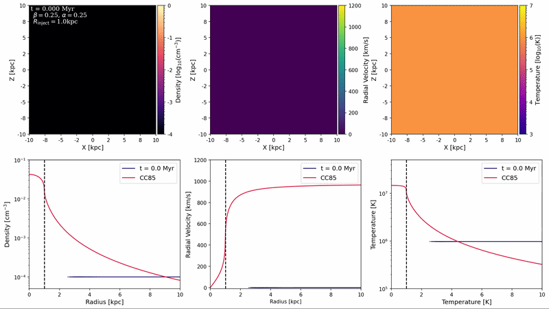
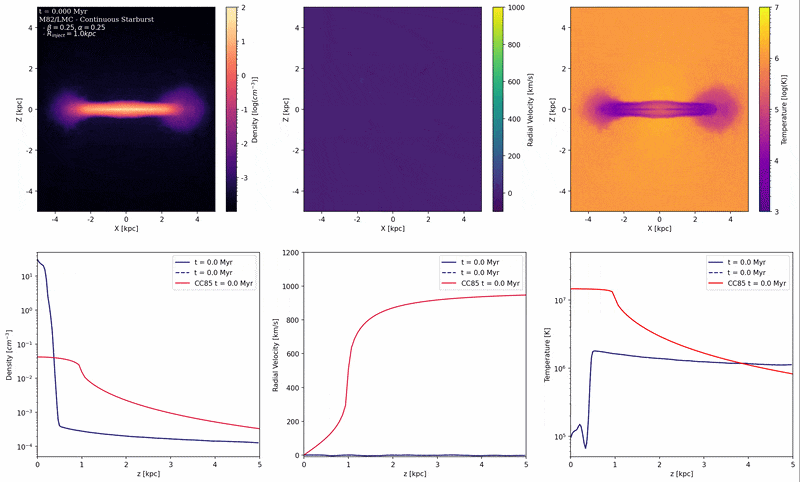
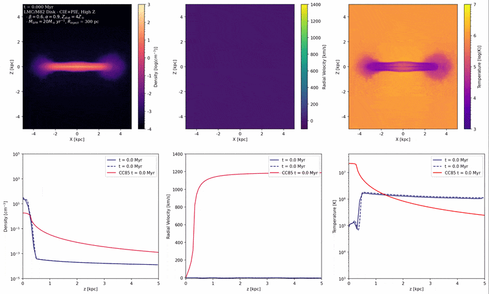
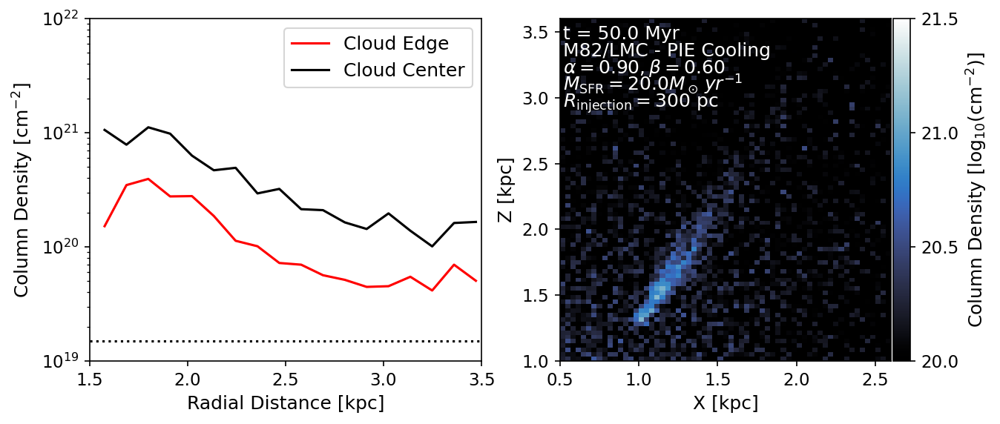
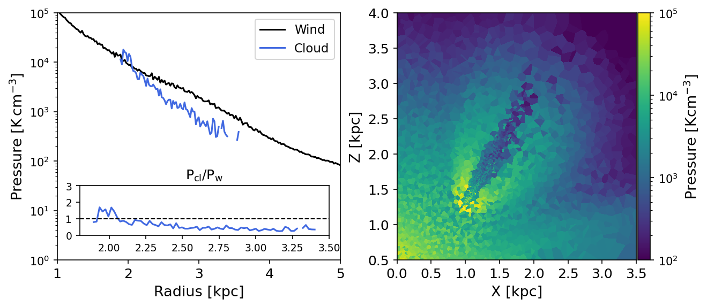

# Feedback Driven Wind Simulations - Analysis
Repository containing the scripts used to compare and analyze a suite of galactic wind simulations built using a modified version of the AREPO moving mesh code (available [here](https://github.com/nelson-group/raph_arepo)). The suite was built as part of a Master Thesis project at the Heidelberg Institute of Theoretical Astrophysics under the supervision of Dr. Dylan Nelson. 

See here for a copy of the [thesis](./msc_thesis.pdf). The styling was adopted from the LaTeX template of [Nils Vu](https://github.com/nilsvu/msc-thesis).

For this project, we adopted the following fiducial parameters:
> [!NOTE]
> The listed fiducial parameters are a composite of the baseline parameters used throughout the thesis and do not correspond to any one simulation.

| Parameter | Description | Fiducial Value | Range |
|------------|--------------|----------------|--------|
| $\alpha$ | Energy loading factor | 0.25 | 0.05–1.8 |
| $\beta$ | Mass loading factor | 0.25 | 0.05–1.0 |
| $\dot{M}_{\rm SFR}$ [M☉ yr⁻¹] | Star Formation Rate | 10 | 10–20 |
| $R_{\rm inject}$ [kpc] | Injection radius | 1.0 | 0.3–2.0 |
| $t_{\rm burst}$ [Myr] | Starburst duration | 100 | 15–100 |
| $t_{\rm rest}$ [Myr] | Time between bursts | 0 | 1–10 |
| $M_{\rm 200}$ [M☉] | Virial mass | 5e10 | 6.5e9–2e12 |
| $c_{\rm NFW}$ | Halo concentration | 10.0 | 6.94–15.0 |
| $Z_{\rm disk}$ [Z☉] | Disk metallicity | 0.0 | 0.0–4.0 |
| $Z_{\rm CGM}$ [Z☉] | CGM metallicity | 0.00 | 0–0.1 |
| $\Delta x$ [pc] | Spatial resolution | 33 | 33–300 |
| $N_{\rm cells}$ | Cells per dimension | 301 | 100–451 |
| $\vec{F}_G$ | Gas self-gravity | Off | Off / On |
| $\Lambda$ | Radiative cooling | Off | Off / CIE / PIE |

A short compilation of some of the key results is shown below.

****
### Spherically Symmetric Winds
Evolution of a spherically symmetric wind. Energy injection into the spherical starburst creates a wind-blown bubble enveloped by a two-layer shock, consisting of an outer blast wave of shocked CGM gas and an interior wind flow that is shocked upon contact with the CGM. The radial evolution of the wind corresponds well to the CC85 model at steady state.

### Winds on a Galactic Disk
Wind driven outward from a spherical starburst embedded within an M82-based galactic disk. The wind evolves as a bicone consisting of an inner bicone of free wind that closely follows CC85, albeit with slightly lower velocities due to gravitational effects from the disk and halo. The outer bicone forms a layer of hot, denser gas with slightly lower velocities. Interactions between the winds and the disk create a dense turbulent shear layer of mixed temperatures and densities.

### Effects of Radiative Cooling on Winds
Radiatively cooled wind driven outward from a spherical starburst embedded within an M82-based galactic disk. The inclusion of radiative cooling suppresses turbulent effects between the disk and the wind. The wind develops a cooling radius beyond which radiative cooling dominants over adiabatic expansion. Additionally, clouds of cold gas are ejected from the center of the disk and accelerated outward, or entrained, by the wind.  

###  Entrained Cold Cloud

Examination of an entrained cold cloud originating from a radiatively cooled wind. The cloud expands differentially and fades away as it is entrained rather than growing in mass as predicted under cloud-crushing studies in plane-parallel winds, e.g. [Gronke and Oh 2018](https://arxiv.org/abs/1806.02728). These results instead correspond with those of [Dutta et al. 2025](https://arxiv.org/abs/2506.08545), where clouds remains locally isobaric with the wind, resulting in a steep decline in the density contrast and eventual dissolution downstream. 